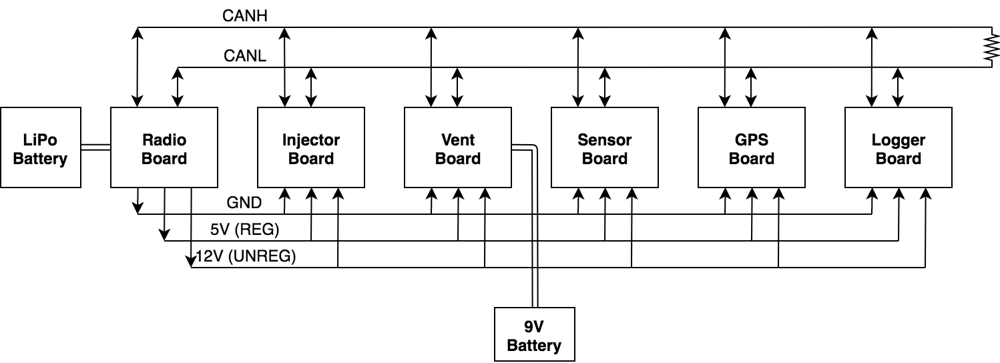
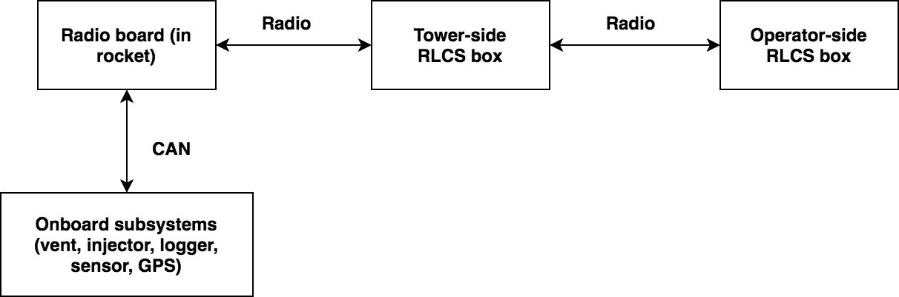

## RocketCAN Hardware

This repository tracks the hardware development for the RocketCAN project. All schematics, board designs, and fabrication files are tracked in this repository. The corresponding software running on each board can be found in the `cansw_*` repositories. The CAN driver library used is tracked in the `canlib` repository.

All hardware files were developed in KiCAD.

### System Architecture

The RocketCAN project is an extension of the 2018 Flight Instrumentation project. The functions of the original Flight Instrumentation electronics are decoupled into several single-function modules connected by a Controller Area Network (CAN bus). The 2019 RocketCAN configuration consists of a radio board, an injector valve driver, a vent valve driver, a flight sensor suite, a system logger, and a GPS receiver. The modules freely share information over the CAN bus, allowing all modules to access resources such as the radio transceiver and sensor module. This minimizes the amount of component and functionality duplication, as well as power consumption (especially by the radio module). Power consumption is reduced further by allowing the radio board to control power to the rest of the system, forcing it into a low-power state while the rocket is idle. The resulting PCBs are also significantly smaller and easier to mount inside the rocket. Finally, RocketCAN’s configuration is easily extensible. A new subsystem simply needs to include a CAN communication module, after which it can communicate with all other boards on the bus. Potential extensions such as a flight computer, a state estimation module, or an air braking system would be able to use existing sensor data without implementing their own independent sensor suite.

At present, the radio board integrates with Waterloo Rocketry's Remote Launch Control System (RLCS), from which it receives instructions. It is also capable of broadcasting sensor data to RLCS.  The radio board communicates with the tower-side box of RLCS, which relays the data to the client-side box at mission control.

The CAN protocol was chosen for its high data rate, priority-based arbitration, and abundance of inexpensive hardware. The bus can safely be used by many boards at once without the risk of a low-priority message (eg. sensor data) preempting a high-priority message (eg. valve command). Microcontrollers with CAN modules, stand-alone CAN modules, and CAN transceivers are all widely available, making it cheap and simple to add CAN functionality to a subsystem.

Further descriptions and instructions for using each individual board are available in the README in the relevant board's directory.
