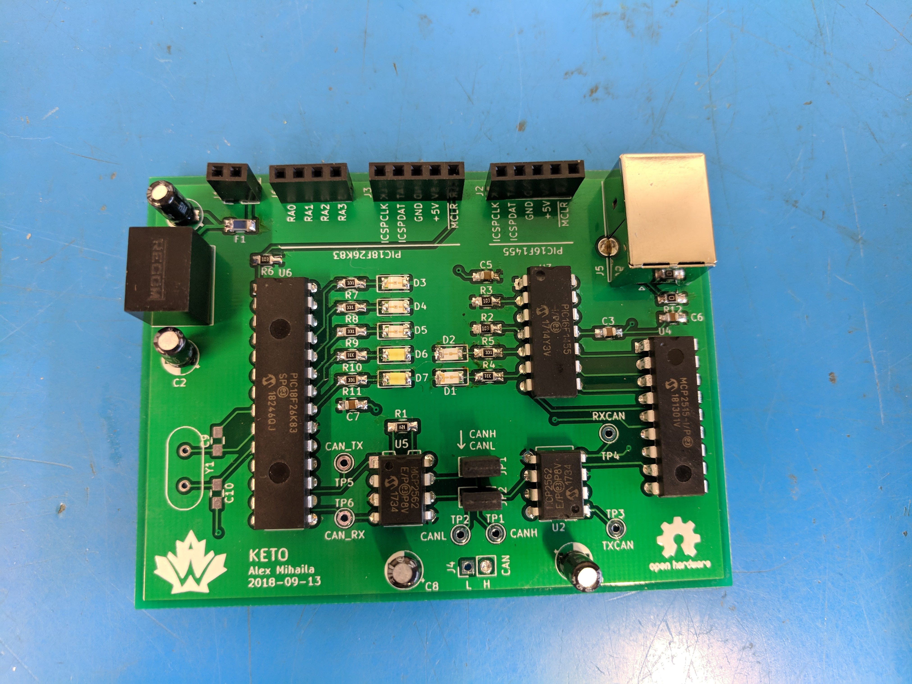

This is a development board meant to be used for writing firmware for the CAN bus project while the main rocket boards are still in the hardware design phase. The board contains a PIC18F26K83 (which will be used on most subsystem boards inside the rocket) and a PIC16F1455 (which is used on the USB debug board). The PIC16F is connected to an external CAN module, allowing the two PICs to communicate with each other over CAN. 

The board is nicknamed "Keto" because it was borne out of a dislike of breadboards.

